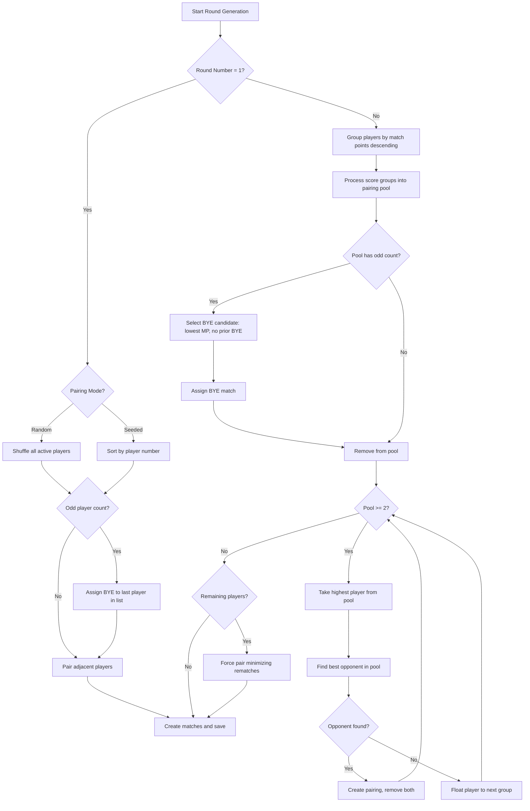

# Swiss Pairing Algorithm

## Overview

The TCG Tournament Manager implements official Swiss pairing rules used in Pokémon TCG, Magic: The Gathering, Yu-Gi-Oh!, One Piece, and Union Arena events.

## Match Points

| Result | Match Points | Game Wins (A) | Game Losses (A) |
|--------|-------------|---------------|-----------------|
| 2-0 Win | 3 | 2 | 0 |
| 2-1 Win | 3 | 2 | 1 |
| 1-2 Loss | 0 | 1 | 2 |
| 0-2 Loss | 0 | 0 | 2 |
| Draw | 1 | 1 | 1 |
| Bye | 3 | 2 | 0 |

## Tie-Breakers (in order)

1. **Match Points** — higher is better
2. **OMW%** — Opponent Match Win Percentage (floor 33%)
3. **GW%** — Game Win Percentage
4. **OGW%** — Opponent Game Win Percentage

## Flowchart



## Pseudocode

```
FUNCTION GenerateRound(tournament):
    players = GetActivePlayers(tournament)
    roundNumber = tournament.currentRound + 1
    standings = CalculateStandings(tournament)
    previousPairings = GetPreviousPairings(tournament)
    byeRecipients = GetByeHistory(tournament)

    IF roundNumber == 1:
        IF mode == RANDOM:
            ordered = Shuffle(players)
        ELSE:
            ordered = SortByPlayerNumber(players)
        pairings = PairAdjacent(ordered, assignByeIfOdd=true)
    ELSE:
        groups = GroupByMatchPoints(players, standings)
        pool = []
        pairings = []

        FOR EACH group IN groups (high to low):
            pool.AddAll(group)

            WHILE pool.Count >= 2:
                IF pool.Count is ODD:
                    bye = SelectLowestMPWithoutBye(pool, byeRecipients)
                    IF bye != null:
                        pairings.Add(ByeMatch(bye))
                        pool.Remove(bye)
                        CONTINUE

                player = pool[0]
                pool.RemoveAt(0)
                opponent = FindBestOpponent(player, pool, previousPairings)

                IF opponent == null:
                    pool.Insert(0, player)  // float down
                    BREAK

                pool.Remove(opponent)
                pairings.Add(Match(player, opponent))

        pairings.AddAll(ForcePairRemaining(pool))

    SaveRound(pairings)
    RETURN pairings

FUNCTION FindBestOpponent(player, candidates, previousPairings):
    best = null
    bestScore = -INFINITY

    FOR EACH candidate IN candidates:
        IF IsRematch(player, candidate, previousPairings):
            rematchPenalty = 1000 IF lastRound ELSE allowWithPenalty
        score = 0
        IF NOT rematch: score += 1000
        IF same match points: score += 100
        score -= abs(player.MP - candidate.MP)

        IF score > bestScore:
            best = candidate

    RETURN best
```

## C# Implementation

See `TcgTournamentManager.Infrastructure/Services/SwissPairingService.cs` for the production implementation.

Key methods:
- `ComputePairings()` — entry point
- `PairRoundOne()` — random or seeded first round
- `PairSubsequentRounds()` — score group pairing with bye handling
- `FindBestOpponent()` — rematch avoidance and pair-down minimization
- `SelectByeCandidate()` — ensures max one bye per player